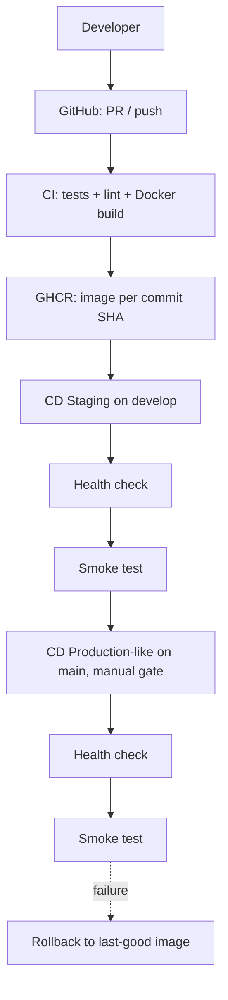

# Secure Event Management System (EMS) — with SRE CI/CD Pipeline

Full-stack Event Management System (FastAPI + PostgreSQL + React, JWT/RBAC) extended with a
production-style **CI/CD and reliability layer**: GitHub Actions pipelines, Docker image builds,
staging + production-like environments, health/readiness probes, smoke tests, automated rollback,
and script-driven operations.

## Architecture



## Technology stack

| Layer | Technology |
|---|---|
| API | FastAPI 0.116, Uvicorn, Pydantic v2, SQLAlchemy 2.0 |
| DB | PostgreSQL 14 (Compose), SQLite fallback for tests |
| Auth | JWT (`python-jose`), bcrypt (`passlib`), RBAC |
| Containers | Docker, Docker Compose (dev / staging / prod-like) |
| CI/CD | GitHub Actions, GHCR, Bash deploy/smoke/rollback scripts |
| Quality | Pytest (39 tests), Ruff, `compileall` |

## Local setup

```bash
git clone https://github.com/matrix29v-eventt/Event-managementsystem.git
cd Event-managementsystem
cp .env.example .env   # fill in real values (never commit .env)
```

## Running the application

```bash
# Dev stack: API :8000, UI :3000, Postgres internal
docker compose up -d --build
curl localhost:8000/health
```

## Running tests

```bash
cd event-management-system
pip install -r requirements.txt
pytest            # 39 tests: health, readiness, auth, API, RBAC, CRUD
```

Also: `python -m compileall -q app tests` and `ruff check app tests`.

## Docker usage

```bash
docker build -t ems-api:local ./event-management-system
docker compose up -d --build          # dev
```

Image runs as non-root (`appuser`), uses layer-cached deps, predictable
`uvicorn app.main:app` startup. See `event-management-system/Dockerfile`.

## CI pipeline (`.github/workflows/ci.yml`)

Runs on PRs and pushes to `develop`/`main`: checkout → Python 3.11 → deps →
`compileall` → Ruff → pytest (SQLite) → Docker build (only if tests pass).

## CD pipelines

- `cd-staging.yml` (push to `develop`): build + push `:<sha>` and `:staging` to
  GHCR → `scripts/deploy.sh staging` (port 8001).
- `cd-production.yml` (push to `main`, `production` environment gate): build +
  push `:<sha>` and `:latest` → `deploy.sh prod` (port 8002).
- Images are immutable SHA tags; aliases are convenience only. Without a
  registry, build locally (`-t ems-api:local`) and deploy that tag.

## Staging / production-like deployments

```bash
# staging
IMAGE_TAG=ghcr.io/<owner>/<repo>/ems-api:<sha> APP_PORT=8001 ./scripts/deploy.sh staging
# production-like (local host, no TLS — not real production infra)
IMAGE_TAG=ghcr.io/<owner>/<repo>/ems-api:<sha> APP_PORT=8002 ./scripts/deploy.sh prod
```

Details: `docs/deployment.md`. Staging: `docker-compose.staging.yml`;
prod-like: `docker-compose.prod.yml` (`restart: always`, required
`CORS_ORIGINS`, log rotation, persistent volumes).

## Health checks

- `GET /health` → `{"status":"healthy"}` (liveness, dependency-free).
- `GET /ready` → `{"status":"ready","database":"connected"}` (readiness via
  request-scoped DB session; `not_ready`/`disconnected` on DB failure).
- Compose `healthcheck` probes `/health` with Python stdlib (slim image has no
  curl); `deploy.sh` blocks on `/health` before smoke tests.

## Smoke tests

```bash
./scripts/smoke_test.sh http://localhost:8001
```

Checks `/health`, `/ready` (+DB), `GET /`, and that bad credentials get 401.
Non-zero exit on first failure — "container started" ≠ "application healthy".

## Rollback

```bash
./scripts/rollback.sh staging
./scripts/rollback.sh prod ghcr.io/<owner>/<repo>/ems-api:<previous-sha>
```

`deploy.sh` records the pre-deploy image (`.prev_image_tag`), auto-restores it
on failure, and records successes (`.last_good_image`); `rollback.sh`
redeploys a known-good tag and re-verifies health + smoke.

## Failure scenarios

Six documented, reproducible cases (test, build, startup, health, DB-down,
bad-release) with symptom → detection → cause → recovery — see
`docs/failure-scenarios.md`.

## Security

Names-only `.env.example`, env-injected secrets, `${VAR:?}` fail-fast,
minimal workflow permissions (`contents: read` + `packages: write` for CD),
ephemeral `GITHUB_TOKEN`, non-root image, no secrets in logs/images.
Full statement: `docs/security.md`.

## Repository structure

```text
.github/workflows/   ci.yml  cd-staging.yml  cd-production.yml
scripts/              deploy.sh  smoke_test.sh  rollback.sh  logs.sh
event-management-system/
  app/  main.py (+/health,/ready)  db.py  auth.py  routers/  models/  schemas/  crud/
  tests/  conftest.py  test_health.py  test_auth.py  test_api.py  (+4 domain suites)
  Dockerfile  requirements.txt  alembic/
docs/  current-architecture.md  deployment.md  security.md  failure-scenarios.md  sre-notes.md
docker-compose.yml  docker-compose.staging.yml  docker-compose.prod.yml
.env.example  .dockerignore  README.md
event-management-frontend/  (React UI, dev Compose only)
```

## SRE scope (honest)

Implemented: CI/CD, SHA tagging, GHCR, staging + prod-like stacks, health +
readiness, smoke tests, auto-rollback, restart policies, structured logs,
failure playbooks. **Not** implemented: Kubernetes, Terraform/Ansible, Jenkins,
Prometheus/Grafana, TLS, multi-node HA — see `docs/sre-notes.md`.

## Future improvements

- Image CVE scanning (Trivy) as a CI gate; signed images (cosign).
- Postgres backup/restore script + tested restore drill.
- `/metrics` endpoint with a couple of RED counters before any full monitoring stack.
- Blue-green deploy to remove the restart window.
